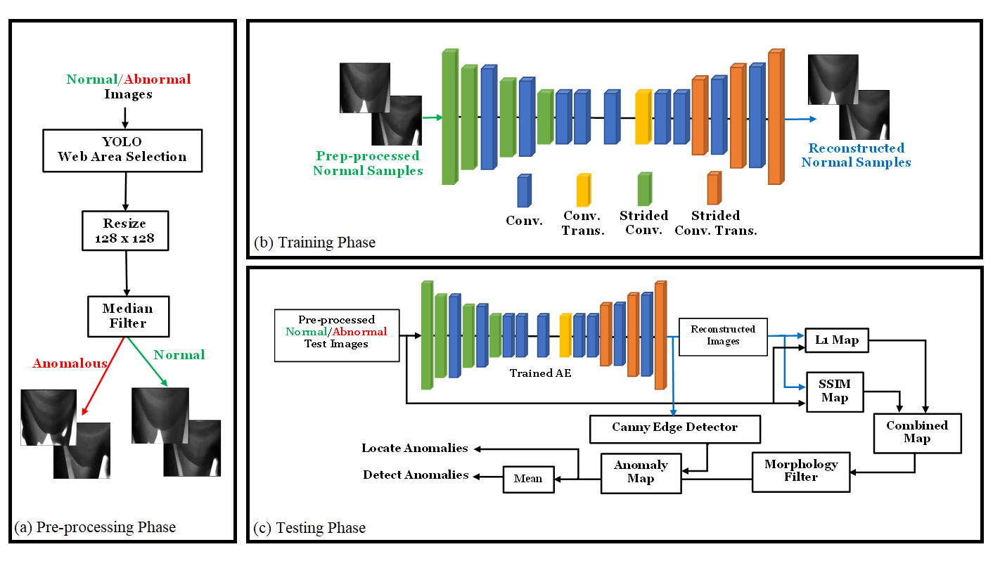
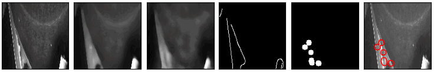
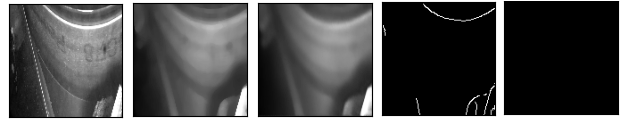

# Description

This is a simple implementation of the "Anomaly Detection and Localization for Images of Running Paper Web in Paper Manufacturing" paper. The main idea is to develop a computer vision approach to detect and locate web defects from paper images of a running web paper in paper manufacturing.

## Model Architecture
An autoencoder-based approach with a pre-processing and post-processing blocks are used to detect and locate anomalies at the same time from paper images. The model overview is shown as follows:

<p align="center">
  
</p>

## Preliminaries

To run the code, one should first the required libraries. To do so, run the following code within a python environment:

```
pip install -r requirements.txt
```

## Training

To train the model, one should first go through the parameters in the `options.py` and set them properly according to his/her application. The Autoencoder itself is defined in `network.py` and can be modified based on the applications. The code will augment the images based on the augmentation parameters and will save them in a specfic path. Then, during the training it will read the augmented images instead of the original images. The resizing and filtering are done in the augmentation code in `utils.py`. To train the model, you can run the following code and define the parameters as it is needed:
```
python train.py --name cam4 --loss ssim_loss --im_resize 128 --patch_size 128 --z_dim 100 --grayscale --do_aug --p_rotate 0. --p_horizonal_flip 0. --p_vertical_flip 0.
```

## Testing

To test the code, one can run the following code based on the requirements:
```
python test.py --name cam4 --loss ssim_loss --im_resize 128 --patch_size 128 --grayscale --percent 98.0
 ```

## Results

The results of applying the approach on the paper images are presented below. The model is able to remove noises with the help of median filter and reduce the false detection alarms with the help of edge attention-based method.

<p align="center">
  
</p>
<p align="center">
    <em>True Positive Detections. From left to the right, original frame, filtered frame, reconstructed image, prominent edges, anomaly map, visualization of detected anomalies.</em>
</p>


<p align="center">
  
</p>
<p align="center">
    <em>True Negative Detections. From left to the right, original frame, filtered frame, reconstructed image, prominent edges, anomaly map.</em>
</p>
